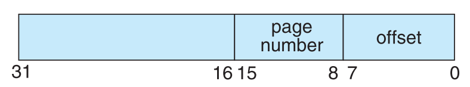

# Design and Implementation of a Virtual Memory Unit (MMU)

This project consists of writing a program that translates logical to physical addresses for a virtual address space of size 216 = 65,536 bytes. Your program will read from a file containing logical addresses and, using a TLB and a page table, will translate each logical address to its corresponding physical address and output the value of the byte stored at the translated physical address. Your learning goal is to use simulation to understand the steps involved in translating logical to physical addresses. This will include resolving page faults using demand paging, managing a TLB, and implementing a page-replacement algorithm.

## Instructions for executing the MMU:
1) Navigate to the project's working directory.
2) Execute the "test.sh" script. This can be done by simply running `./test.sh`
3) An output.csv file will be generated with the columns specified in the sections below.
4) The statistics outlined in the same readme file will be printed to stdout.

## To Specify Page Replacement:
1) Open the C source file "mmu.c" in vim or a simple text editor.
2) Modify the definition of "PHYS_MEM_SIZE" according to the instructions in the code comments for the grader.
   > a) Set to 256 for NO page replacement  
   > b) Set to 128 for pagee replacement
3) Save the source file and exit.
4) Run the `test.sh` script to compile and execute the updated code, as outlined in the instructions above.

### Details
This program reads a file containing several 32-bit integer numbers that represent logical addresses. However, we are only concerned with the 16-bit addresses, so the rightmost 16 bits of each logical address are masked. These 16 bits are divided into (1) an 8-bit page number and (2) an 8-bit page offset. Hence, the addresses are structured as shown as:

<!--  -->

Other specifics include the following:
* 28 entries in the page table 
* Page size of 28 bytes 
* 16 entries in the TLB 
* Frame size of 28 bytes 
* 256 frames 
* Physical memory of 65,536 bytes (256 frames × 256-byte frame size)    

Additionally, this program is only concerned with reading logical addresses and translating them to their corresponding physical addresses. Writing to the logical address space is outside the scope of this repository.

### Address Translation
This project translates logical to physical addresses using a TLB and page table. First, the page number is extracted from the logical address, and the TLB is consulted. In the case of a TLB hit, the frame number is obtained from the TLB. In the case of a TLB miss, the page table must be consulted. In the latter case, either the frame number is obtained from the page table, or a page fault occurs. A visual representation of the address-translation process is:

### Handling Page Faults
This program implements demand paging. The backing store is represented by the file `BACKING STORE.bin`, a binary file of size 65,536 bytes located in this repository. When a page fault occurs, a 256-byte page is read from the file BACKING STORE and store it in an available page frame in physical memory. For example, if a logical address with page number 15 resulted in a page fault, your program would read in page 15 from BACKING STORE (NOTE: pages begin at 0 and are 256 bytes in size) and store it in a page frame in physical memory. Once this frame is stored (and the page table and TLB are updated), subsequent accesses to page 15 will be resolved by either the TLB or the page table.

### Test Files Located in this Repo
The file `addresses.txt` has been provided, which contains integer values representing logical addresses ranging from 0 to 65535 (the size of the virtual address space). The program opens this file, read each logical address and translate it to its corresponding physical address, and output the value of the signed byte at the physical address.

### Page Replacement
Thus far, this project has assumed that physical memory is the same size as the virtual address space.
In practice however, physical memory is typically much smaller than a virtual address space. This phase of the project now 
assumes using a smaller physical address space with 128 page frames rather than 256. This change will require modifying 
your program so that it keeps track of free page frames as well as implementing a page-replacement policy using 
LRU (Section 10.4) to resolve page faults when there is no free memory.

### How to Run Your Program
The script `test.sh` has been included as an execution script for this program. The program will read in the file `addresses.txt`, 
which contains 1,000 logical addresses ranging from 0 to 65535. Each logical address is then translated to a physical address and its contents are stored as a signed byte at the correct physical address.

The output is a comma-separated values (CSV) file called `output.csv` that has three columns:

* Column 1: the logical address being translated (the integer value being read from `addresses.txt`).
* Column 2: the corresponding physical address (what your program translates the logical address to).
* Column 3: the signed byte value (i.e., the binary value) stored in physical memory at the translated physical address.

A sample file for my `output.csv` has been included for reference of the correct physical address values for the file `addresses.txt`.

### Statistics 
After completion, the program reports the following statistics in the standard output (i.e., stdout) as well:
1. Page-fault rate: the percentage of address references that resulted in page faults.
2. TLB hit rate: the percentage of address references that were resolved in the TLB.

Since the logical addresses in `addresses.txt` were generated randomly and do not reflect any memory access locality, 
do not expect to have a high TLB hit rate.
